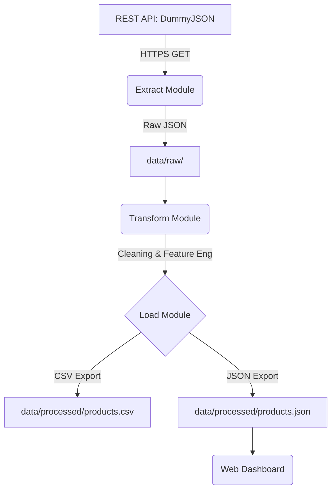

# 🚀 API Flow Forge
### Automated ETL Pipeline for REST API Data Integration

**API Flow Forge** is a robust, production-ready ETL (Extract, Transform, Load) pipeline built with Python. It demonstrates the complete lifecycle of data handling—from consuming external REST APIs to creating enriched, analysis-ready datasets and visualizing them through a modern dashboard.

---

## 🛠️ Architecture & Workflow



1.  **Extract**: Consumes the Products API using `requests` with full pagination support and error handling.
2.  **Transform**: Performs data cleaning, type casting, and generates business-centric features like `inventory_value` and `rating_class`.
3.  **Load**: Exports the refined dataset into localized storage (CSV and JSON) optimized for BI tools or frontend consumption.

---

## ⚡ Key Features

- **Professional Logging**: Trace every step of the pipeline in `logs/etl.log`.
- **Feature Engineering**: Calculates total stock value, applies discounts, and classifies ratings.
- **Robust Exception Handling**: Manages API timeouts, HTTP errors, and malformed data.
- **Visual Insights**: Includes a stunning glassmorphic dashboard to visualize the processed results.

---

## 🚀 Getting Started

### 1. Prerequisites
- Python 3.9+
- `pip` or `pnpm`

### 2. Installation
```bash
pip install -r requirements.txt
```

### 3. Run the Pipeline
```bash
python app/main.py
```

### 4. View Dashboard
Open `index.html` in your browser. (Recommended: Use a local server like Live Server or `python -m http.server` to avoid CORS issues).

---

## 📁 Project Structure
```bash
api-flow-forge/
├── app/                  # Main source code
│   ├── main.py           # Orchestrator
│   ├── extract.py        # API logic
│   ├── transform.py      # Business logic
│   ├── load.py           # Export logic
│   ├── config.py         # App settings
│   └── utils.py          # Log helpers
├── data/                 # Data storage
│   ├── raw/              # Immutable raw data
│   └── processed/        # Refined output
├── logs/                 # Execution logs
├── index.html            # Visual Dashboard
└── README.md             # Documentation
```

---

## 📝 License
This project is part of a professional portfolio. Feel free to use it as a reference for your own data engineering tasks.
